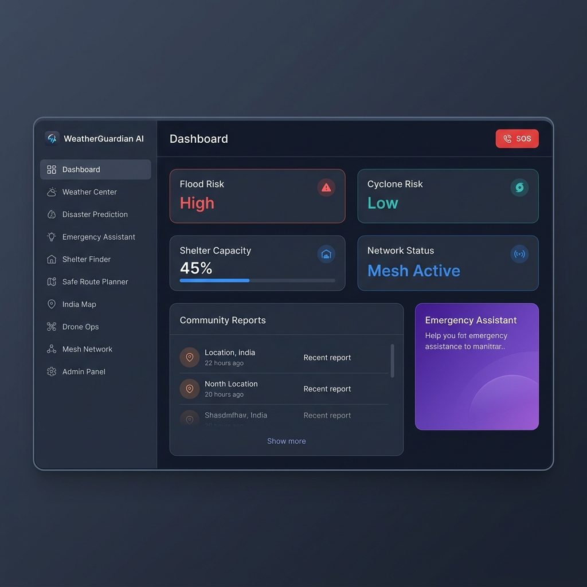
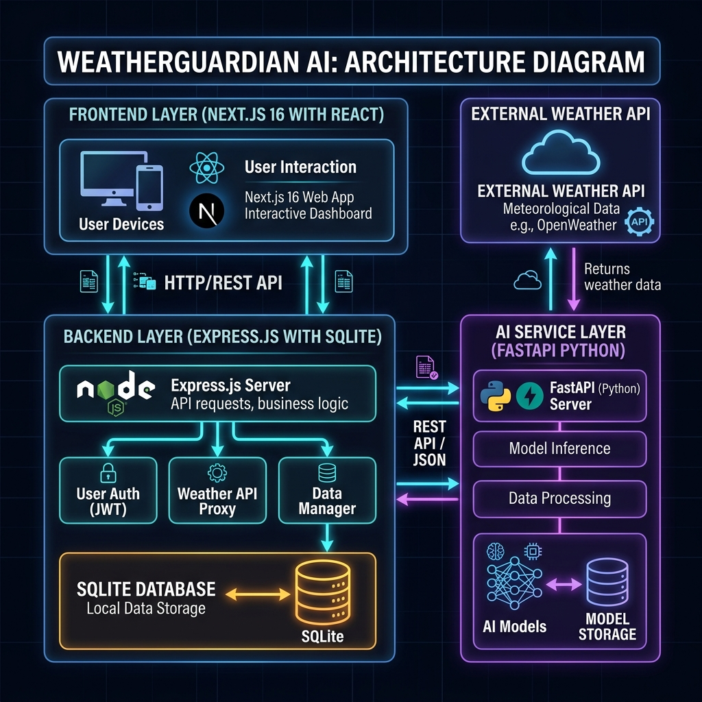
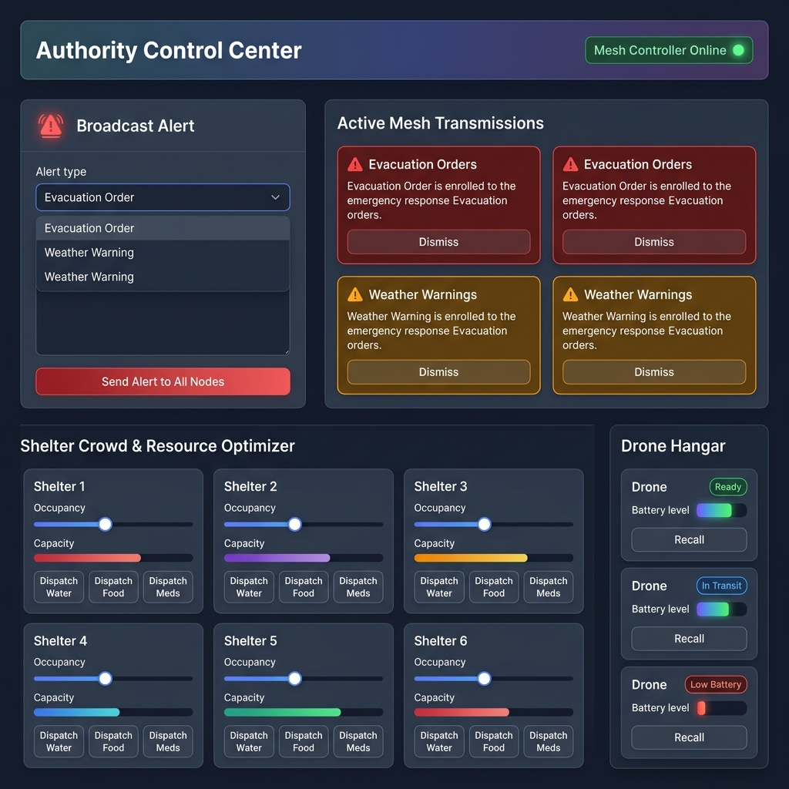
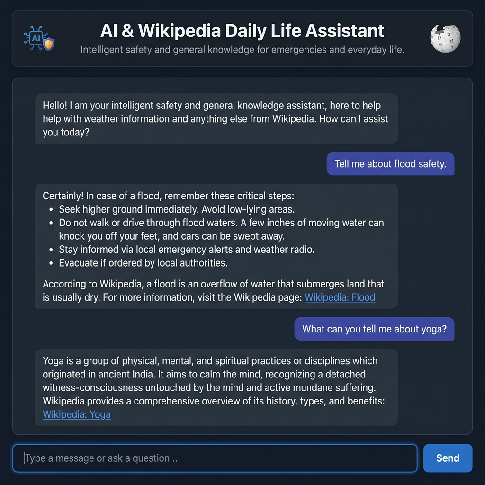
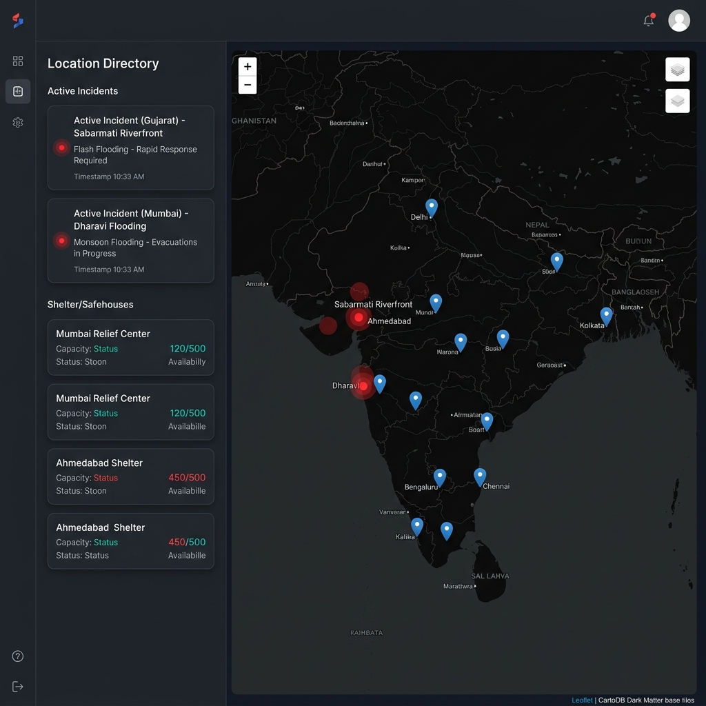

# WeatherGuardian AI



## 🌤️ Overview
WeatherGuardian AI is an **offline‑capable, AI‑powered emergency weather response platform** built for India.  It combines real‑time weather alerts, a mesh‑network simulator, drone logistics, and a Wikipedia‑backed daily‑life assistant to help communities stay safe during natural disasters.

---

## 📚 Features
- **Admin Control Center** – Broadcast alerts, monitor mesh network traffic, dispatch drones, and manage shelter capacity.
- **AI & Wikipedia Assistant** – Natural‑language chat that pulls contextual information from Wikipedia for everyday queries (safety tips, health advice, etc.).
- **Drone Operations** – Deploy/recall simulated UAVs to deliver water, food, medicine to shelters.
- **Shelter Management** – Real‑time occupancy sliders, resource‑dispatch optimizer.
- **India Map Tracker** – Interactive Leaflet map with live incident markers and shelter locations.
- **Mesh Network Simulator** – Offline‑first peer‑to‑peer communication layer for resilient data sharing.
- **Weather Center** – Pulls live weather data and runs basic forecasting models.
- **Dark‑mode UI** – Premium, glass‑morphism style with smooth micro‑animations.

---

## 🗺️ Architecture


- **Frontend** – Next.js 16 (App Router) + React 19, Tailwind CSS, Leaflet for maps.
- **Backend** – Express.js REST API (port 3001) with SQLite for fast local persistence.
- **AI Service** – FastAPI (port 8000) that integrates the Wikipedia API.
- **External Integrations** – OpenStreetMap tiles, Wikipedia REST API, offline mesh network simulator.

---

## 📂 Repository Structure
```
├─ backend/                # Express server and SQLite DB
│   ├─ db.js               # DB schema (alerts, drones, shelters)
│   └─ server.js           # REST endpoints
├─ frontend/               # Next.js UI
│   ├─ src/app/            # Pages (admin, drones, map, …)
│   └─ src/components/     # Reusable UI components
├─ ai_service/             # FastAPI AI assistant
│   └─ main.py
├─ docs/                   # Documentation & images
│   └─ images/             # Workflow screenshots
└─ README.md               # This file
```

---

## 🛠️ Setup & Run Locally
```bash
# Clone the repo (already done)
cd my-first-project

# Backend (Node)
cd backend
npm install
npm start   # runs on http://localhost:3001

# Frontend (Next.js)
cd ../frontend
npm install
npm run dev # runs on http://localhost:3000

# AI Service (Python)
cd ../ai_service
python -m venv venv
venv\Scripts\activate
pip install -r requirements.txt
uvicorn main:app --port 8000
```

Visit **http://localhost:3000** to explore the platform.

---

## 📸 Screenshots
| Page | Preview |
|------|---------|
| Dashboard |  |
| Admin Control Center |  |
| AI Assistant |  |
| India Map Tracker |  |

---

## 🚀 Deploy to GitHub
The repository is already linked to GitHub.  After any local changes:
```bash
git add .
git commit -m "Your commit message"
git push origin main
```
All commits are automatically reflected on the remote **WeatherGuardian‑AI** repo.

---

## 🤝 Contributing
Feel free to open issues or PRs.  Follow the contribution guidelines:
- Keep the dark‑mode aesthetic consistent.
- Write unit tests for new API endpoints.
- Update the README with any new screenshots.

---

## 📄 License
MIT License – see `LICENSE` for details.
