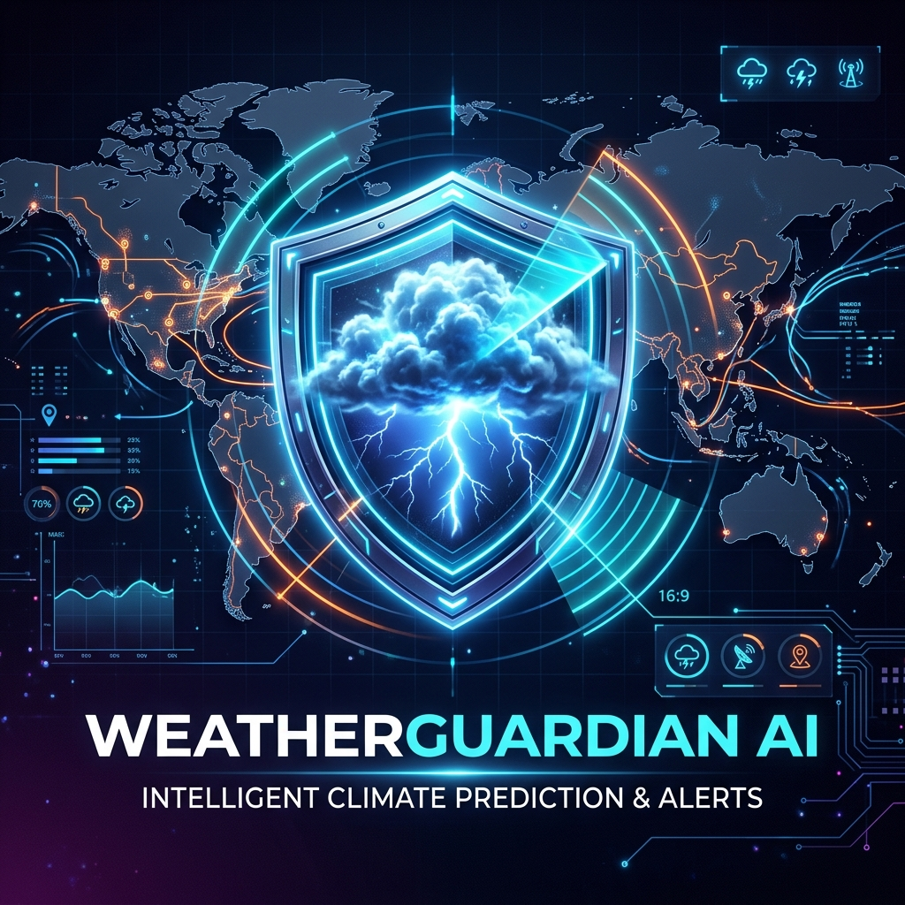
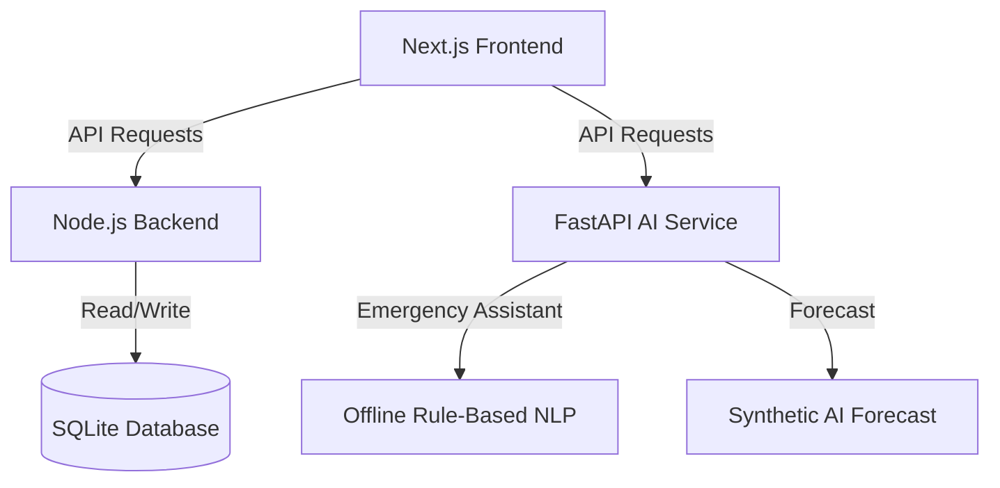

# 🛡️ WeatherGuardian AI

> A modern, resilient, and intelligent emergency management and offline-ready weather assistant system.



## 📌 Project Overview
**WeatherGuardian AI** is an end-to-end platform built to ensure safety, communication, and resource coordination during extreme weather events and natural disasters. The project is designed with resilience in mind, featuring offline-first capabilities like local rule-based NLP assistants, SQLite-backed shelter information systems, and simulated mesh network/drone routing.

---

## 🚀 Architecture & Technical Stack

The repository is structured as a monorepo consisting of three core services:



### 1. 💻 Frontend (`/frontend`)
*   **Framework**: Next.js 14+ (App Router)
*   **Styling**: Tailwind CSS & Modern Glassmorphism
*   **Key Views**:
    *   **Emergency Assistant**: Chatbot for safety instructions.
    *   **Shelter Map**: Leaflet/Map visualizer showing nearby emergency shelters with capacity, occupancy, and available facilities.
    *   **Mesh & Drones**: Simulated drone paths and mesh network node health checks for emergency communications.
    *   **Weather Alerts**: Local weather forecasts with high-risk probability indicators.

### 2. ⚙️ Backend Service (`/backend`)
*   **Runtime**: Node.js & Express
*   **Database**: SQLite (`weather_guardian.db`)
*   **Key APIs**:
    *   `GET /api/health` - Service health monitor.
    *   `GET /api/shelters` - Real-time query of emergency shelters, locations, current capacity, and amenities.

### 3. 🧠 AI Service (`/ai_service`)
*   **Framework**: FastAPI (Python 3.10+)
*   **Core Capabilities**:
    *   **Offline NLP Chatbot**: Instantly answers queries for floods, fires, and earthquakes with actionable survival steps without external internet requirements.
    *   **Synthetic Forecast Engine**: Generates micro-climate risk profiles (e.g., Heatwave, Storm probabilities).

---

## 🛠️ Getting Started & Installation

### Prerequisites
*   [Node.js (v20+)](https://nodejs.org)
*   [Python (v3.10+)](https://python.org)

### Step 1: Clone & Navigate
```bash
git clone https://github.com/VedPatel8181/WeatherGuardian-AI.git
cd WeatherGuardian-AI
```

### Step 2: Running the Services

#### 🔹 Start the Backend Server
```bash
cd backend
npm install
npm start
```
*Backend runs on: `http://localhost:3001`*

#### 🔹 Start the FastAPI AI Service
```bash
cd ai_service
# Setup virtual environment
python -m venv venv
./venv/Scripts/activate # On Windows
source venv/bin/activate # On macOS/Linux

pip install -r requirements.txt
pip install uvicorn
uvicorn main:app --reload --port 8000
```
*AI Service runs on: `http://127.0.0.1:8000`*

#### 🔹 Start the Next.js Frontend
```bash
cd frontend
npm install
npm run dev
```
*Frontend runs on: `http://localhost:3000`*

---

## ⛓️ GitHub Actions Workflows

We have integrated a robust CI/CD workflow (`.github/workflows/ci.yml`) to automatically test the stability of all three components on every push:
1.  **Frontend CI**: Verifies compilation and Next.js builds.
2.  **Backend CI**: Spins up the Express server and performs a smoke health test.
3.  **AI Service CI**: Builds python requirements, starts FastAPI, and performs API response validation.

---

## 📄 License
This project is licensed under the MIT License.
